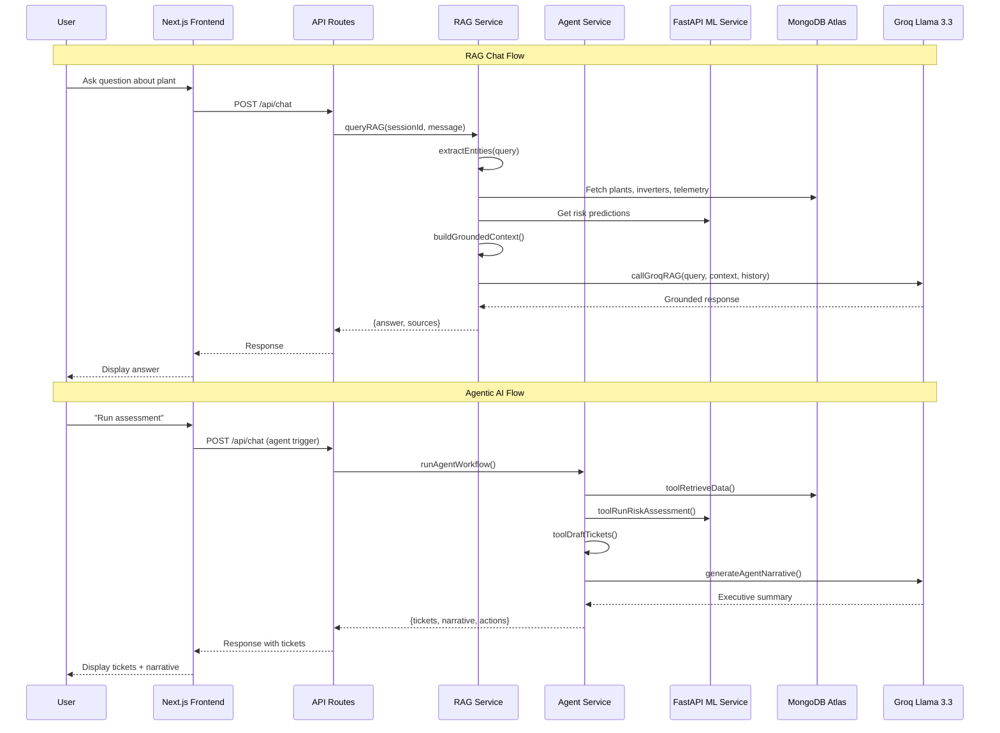

# System Architecture — Solar Intel

## High-Level Architecture Diagram

```mermaid
graph TB
    subgraph "Frontend — Next.js 14"
        UI[Dashboard / Plants / Chat]
        AUTH[NextAuth.js]
        I18N[15-Language i18n]
    end

    subgraph "API Layer — Next.js Route Handlers"
        API_DASH[/api/dashboard]
        API_INV[/api/inverters]
        API_PLANT[/api/plants]
        API_CHAT[/api/chat]
        API_IMPORT[/api/import]
        API_AI[/api/ai-advisor]
        API_PRED[/api/predict]
    end

    subgraph "Backend Services"
        DASH_SVC[Dashboard Service]
        INV_SVC[Inverter Service]
        PLANT_SVC[Plant Service]
        RAG_SVC[RAG Service]
        AGENT_SVC[Agent Service]
        AI_SVC[AI Advisor Service]
        ML_SVC[ML Prediction Service]
    end

    subgraph "ML Service — FastAPI"
        FASTAPI[FastAPI Server :8000]
        MODEL[HistGradientBoosting Model]
        SHAP[SHAP Explainer]
    end

    subgraph "External Services"
        GROQ[Groq Llama 3.3 70B]
        MONGO[(MongoDB Atlas)]
        WEATHER[Open-Meteo API]
    end

    UI --> AUTH
    UI --> API_DASH
    UI --> API_INV
    UI --> API_PLANT
    UI --> API_CHAT
    UI --> API_IMPORT
    UI --> API_AI

    API_DASH --> DASH_SVC
    API_INV --> INV_SVC
    API_PLANT --> PLANT_SVC
    API_CHAT --> RAG_SVC
    API_CHAT --> AGENT_SVC
    API_AI --> AI_SVC
    API_PRED --> ML_SVC
    API_IMPORT --> MONGO

    DASH_SVC --> ML_SVC
    DASH_SVC --> MONGO
    INV_SVC --> MONGO
    PLANT_SVC --> ML_SVC
    PLANT_SVC --> MONGO
    RAG_SVC --> MONGO
    RAG_SVC --> GROQ
    AGENT_SVC --> ML_SVC
    AGENT_SVC --> GROQ
    AGENT_SVC --> MONGO
    AI_SVC --> ML_SVC
    AI_SVC --> GROQ

    ML_SVC --> FASTAPI
    FASTAPI --> MODEL
    FASTAPI --> SHAP

    DASH_SVC --> WEATHER

    classDef frontend fill:#7c3aed,stroke:#a855f7,color:#fff
    classDef api fill:#2563eb,stroke:#3b82f6,color:#fff
    classDef service fill:#059669,stroke:#10b981,color:#fff
    classDef ml fill:#dc2626,stroke:#ef4444,color:#fff
    classDef external fill:#d97706,stroke:#f59e0b,color:#fff

    class UI,AUTH,I18N frontend
    class API_DASH,API_INV,API_PLANT,API_CHAT,API_IMPORT,API_AI,API_PRED api
    class DASH_SVC,INV_SVC,PLANT_SVC,RAG_SVC,AGENT_SVC,AI_SVC,ML_SVC service
    class FASTAPI,MODEL,SHAP ml
    class GROQ,MONGO,WEATHER external
```

## Data Flow



## Component Summary

| Component | Technology | Purpose |
|-----------|-----------|---------|
| Frontend | Next.js 14, React 18, TailwindCSS | 9-page SPA with real-time dashboards |
| Auth | NextAuth.js v4 | Google OAuth + Dev Login |
| Database | MongoDB Atlas | Plants, inverters, telemetry, users |
| ML Model | HistGradientBoosting (scikit-learn) | Binary classification: healthy vs faulty |
| ML API | FastAPI + Uvicorn | /predict, /predict/batch, /health |
| SHAP | SHAP (TreeExplainer) | Top-5 feature importance |
| LLM | Groq Llama 3.3 70B Versatile | Narratives, RAG, agent summaries |
| RAG | Custom (entity extraction + MongoDB) | Grounded Q&A from fleet data |
| Agent | Autonomous 4-step workflow | Data → Risk → Tickets → Narrative |
| i18n | 15 languages (static + Google Translate) | Full UI translation |
| Import | papaparse + xlsx | CSV/Excel plant & inverter import |
| Docker | Multi-stage builds | Containerized deployment |
